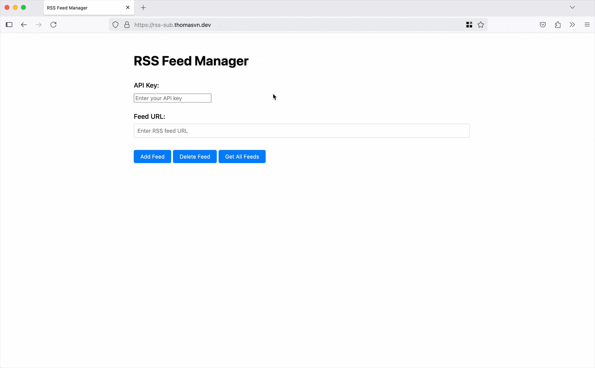

# RSS Subscriber

An app to subscribe to RSS feeds, and receive daily email notifications. Built using val.town serverless functions, and currently configured for personal use only.

This project is a personal implementation inspired by <https://blogtrottr.com/>. To deploy it yourself, follow the instructions in [SETUP.md](./SETUP.md)

## Demo

<https://rss-sub.thomasvn.dev/>

<!-- TODO:
- Use rss parsing library
- Put the body of the blog post, in the body of the email?
- Allow users to create an account?
-->

<!-- DONE:
- Endpoint to get all posts within the last week
- The GET endpoints shouldn't require an API key
- Docs on how to configure your own valtown
- Hook up to Netlify & DNS (rss-sub.thomasvn.dev)
- Working API handlers for adding/deleting RSS feeds
-->
